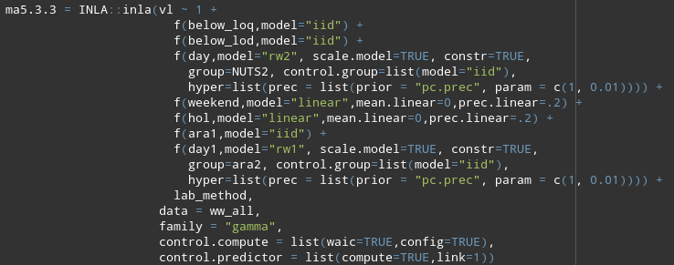

```{r setup, include=FALSE}
knitr::opts_chunk$set(echo = FALSE)
# controls
analysis_date = "2023-09-29"
period_dates = c("2022-05-16","2022-09-05","2023-01-02","2023-07-03")
controls = list(analysis_date=analysis_date,
                period_dates=period_dates,
                savepoint=paste0("../savepoints/savepoint_",analysis_date,"/"))
# libs
pacman::p_load(tidyverse,lubridate,ISOweek,INLA,inlabru,sf,cowplot,spdep,scales,flextable)
# source custom functions
fili = dir(path="../R/",pattern="mw_[013456789]",full.names = TRUE)
lapply(X = fili, FUN = function(x) {source(paste0(x), echo=FALSE)})
# load data
ww1 = readRDS(fs::path(controls$savepoint,"ww1.rds"))
shapes = readRDS(fs::path(controls$savepoint,"shapes.rds"))
# aesthetics
theme_set(theme_bw())
theme_update(text = element_text(size=7))
cust_cols = c("dodgerblue","firebrick2","goldenrod2")
```

## Disease surveillance

Definition *(Langmuir, 1963)*:

\bigskip

```{=tex}
\begin{quote}
Surveillance, when applied to a disease, means the \alert{continued watchfulness} over the distribution and trends of incidence through the systematic \alert{collection}, \alert{consolidation} and \alert{evaluation} of morbidity and mortality reports and other relevant data.
\end{quote}
```

## Objectives of disease surveillance *(Declich, 1994)*

To describe the \alert{ongoing patterns} of disease:
        
  -   identify trends and acute changes \pause\medskip

To link with \alert{public health action}:

  -   disease investigation and control

  -   health services planning

  -   evaluation of measures \pause\medskip

To study the \alert{natural history} and \alert{epidemiology} of diseases:

  -   not limited to those diseases for which effective control measures are available

## Historical origins of disease surveillance

```{=tex}
\begin{figure}
\centering
\includegraphics[width=\linewidth]{figures/isolation_hospital_lazzaretto_vecchio_wikicommons.jpg}
\caption{The quarantine hospital on Lazzaretto Vecchio island was at the center of Venice's vast \alert{public health response} to the Black Death in the 14th century \textit{(Wikimedia commons)}.}
\end{figure}
```

## Historical origins of disease surveillance

```{=tex}
\begin{figure}
\centering
\includegraphics[width=.7\linewidth]{figures/london_bill_of_mortality_1664.jpg}
\caption{In 17th-century London, in response to recurrences of bubonic plague, authorities instituted the weekly publication of a \alert{Bill of Mortality} detailing the number of burials with cause of death \textit{(Wellcome Library)}.}
\end{figure}
```

## Historical origins of disease surveillance

```{=tex}
\begin{figure}
\centering
\includegraphics[width=.5\linewidth]{figures/declich_developments_20th_Century.jpg}
\caption{Developments of disease surveillance since the end of the 19th century \textit{(Declich, 1994)}.}
\end{figure}
```


## Infectious disease surveillance today

Passive surveillance:

-   \alert{mandatory notification} of cases by doctors and labs

-   administrative data (encoded hospital billing data)

-   vital statistics \pause\bigskip


Active surveillance:

- outbreak investigation

- sentinel systems

- population-based surveys

- \alert{wastewater-based epidemiology}


## Background

Wastewater-based epidemiology (WBE):

-   first proposed by Daughton (2001) for monitoring \alert{illicit drugs}

-   extension to pharmaceuticals, tobacco, alcohol, pesticides, heavy metals... (Choi, 2018)

-   extension to \alert{infectious diseases} (Mao, 2020)


## Background

WBE for infectious disease surveillance:

- \alert{early warning signals} (identify circulating pathogens/variants)

- \alert{spatio-temporal trends?}

```{=tex}
\begin{figure}
\centering
\includegraphics[width=.5\linewidth]{figures/wastewater-surveillance-illustration-cdc}
\caption{WBE for infectious disease surveillance \textit{(CDC)}.}
\end{figure}
```


## Background

Data-generating mechanism:

- SARS-CoV-2 incidence

- \alert{Fecal shedding profile} (1-2 weeks, up to 7 months)

- Circulation in wastewater pipes, sample collection

- Quantification with RT-PCR

```{=tex}
\begin{figure}
\centering
\includegraphics[width=.5\linewidth]{figures/shedding}
\caption{Fecal viral RNA concentration in stool samples over time \textit{(Natarajan et al., 2022)}.}
\end{figure}
```


## Data

Wastewater surveillance of SARS-CoV-2 in Switzerland:

-   started 7 February 2022

-   maximal \alert{118 wastewater plants} (ARA for *Abwasserreinigungsanlagen*)

-   fluctuations in the number of ARAs, down to 14 after July 2023

-   various sampling frequencies (3 to 6 times per week)

-   samples sent to \alert{9 different laboratories} (1 lab after July 2023)

-   `r nrow(ww1)` total measurements as of `r format(max(ww1$date),"%d %B %Y")`

## Data

Raw data consists of \alert{concentrations} in gene copies per liter [gc/L]

- account for \alert{wastewater flow} [m3/day] (rain, activity...)

- account for \alert{population} covered by the ARA

- formula for \alert{viral load per population} [gc/day/100,000 population]

$$
VL = \frac{\text{concentration} \times \text{flow} \times 1,000}{\text{population} / 100,000}
$$


## Data

```{r data_mis1, fig.height=4,fig.width=5.5}
ww1 %>% 
  ggplot() +
    geom_point(aes(x=date,y=ara_kt,colour=kt),size=.3) +
    scale_y_discrete(limits=rev) +
    scale_colour_discrete(guide="none") +
    theme(axis.text.y = element_text(size=3)) +
    labs(x="Date",y="ARA")
```


## Data

```{r data_mis2, fig.height=3.5,fig.width=4.5, fig.cap="Number of viral load measurements by ARA."}
mw_110_map_missing(ww1,shapes)
```


## Data

Large \alert{heterogeneity} across time and space:

```{r data_vl1, fig.height=2.3,fig.width=4,fig.cap="Daily SARS-CoV-2 viral load in wastewater by ARA (removing values below the LOD or LOQ)."}
mw_106_fig_vl_time(ww1)
```


## Data

Difficulties of \alert{interpretation}:

```{=tex}
\begin{figure}
\centering
\includegraphics[width=.9\linewidth]{figures/lausanne}
\caption{Viral load in wastewater as of 31 October 2023, Lausanne VD (Vidy) \textit{(FOPH dashboard, covid19.admin.ch)}.}
\end{figure}
```
## Objectives

1.  Disentangle the \alert{various sources of heterogeneity}

-   laboratory, quantification method, systematic temporal or spatial effects, remaining noise... \pause\bigskip

2.  Extract a clean, \`\`noise-free'' \alert{temporal signal}

-   at the national and/or regional level \pause\bigskip

3.  Assess the \alert{agreement} with other types of surveillance

-   confirmed cases, hospitalizations, Sentinella, CH-SUR, pooled tests... \pause\bigskip

## Objectives

4.  Forecasting/nowcasting

-   historical data, LFO validation \pause\bigskip

5.  Future surveillance strategies

-   site selection, sampling frequency, rotation

## Methods

\alert{Space-time} model based on gamma regression, accounting for:

-   limits of detection (LOD) and of quantification (LOQ)\pause

-   systematic temporal effects (public holidays, weekends) \pause

-   national \alert{time trend} (RW2)

-   \alert{systematic shift} for each ARA (IID)

-   deviations from national trend for each ARA (RW1) \pause

-   effect of \alert{laboratory} and quantification method

<!-- ## Methods -->

<!--  -->

## Results

Posterior predictive check (\alert{model fit}) is quite good.

```{r res_fit1, fig.height=7,fig.width=12,fig.cap="Model fit."}

ma5.3.2 = readRDS(file=paste0(controls$savepoint,"ma5.3.2.rds"))

# ma5.3.3 = readRDS(file=paste0(controls$savepoint,"ma5.3.3.rds"))

ww_all = readRDS(file=paste0(controls$savepoint,"ww_all.rds"))

corr_all_ara = readRDS(file=paste0(controls$savepoint,"corr_all_ara.rds"))

ppp_vl_ara(ww_all,ma5.3.2) + facet_wrap(~ara_name,ncol=10) + labs(title=NULL)

```

## Results

Posterior predictive check (\alert{model fit}) is generally quite good.

```{r res_fit2, fig.height=2.3,fig.width=4,fig.cap="Model fit."}

ppp_vl_ara(ww_all,ma5.3.2,selection=1:6) + facet_wrap(~ara_name,ncol=3) + labs(title=NULL)

```

## Results

Effect of \alert{laboratory} and method (reference is EAWAG_0):

-   $\exp(\beta)$ can be interpreted as a \alert{relative viral load}, e.g., the viral load is *on average* 1.39 times higher (0.88 to 2.18) in KLZH than EAWAG_0

```{r res1,  out.width="70%", fig.height=2.1,fig.width=4,fig.cap="Estimated effect of laboratory (laboratory name) and method change (marked by 0 and 1)."}

plot_exp_vl(ma5.3.2,pars="lab|method", ref="EAWAG_0", clean.out = "lab_method")

```

## Results

Effect of \alert{public holidays} and \alert{weekends}:

-   no clear influence

```{r res2,  out.width="50%", fig.height=2.1,fig.width=3,fig.cap="Estimated effect of holidays and weekends."}

plot_exp_vl(ma5.3.2,pars="weekend|hol", ref=NULL) + coord_cartesian(ylim=c(.5,2))

```

## Results

Effect of \alert{specific ARAs}:

-   some ARAs have consistently higher or lower viral loads

-   may be issues with \alert{population} covered (tourism...)

```{r res3,  out.width="50%", fig.height=3.5,fig.width=4,fig.cap="Estimated ARA-specific effects."}

mw_130_map_relative_vl(ma5.3.2,corr_all_ara,shapes,forestplot=TRUE, top=10) +

  labs(title=NULL,y="Relative VL")

```

## Results

Effect of \alert{specific ARAs}:

-   some ARAs have consistently higher or lower viral loads

-   may be issues with \alert{population} covered (tourism...)

```{r res4,  out.width="80%", fig.height=3.5,fig.width=4,fig.cap="Estimated ARA-specific effects."}

mw_130_map_relative_vl(ma5.3.2,corr_all_ara,shapes,forestplot=FALSE) +

  labs(title=NULL,y="Relative VL")

```

## Results

Average temporal trend at the \alert{national} level:

-   accounts for all aspects described before

```{r res5,  out.width="80%", fig.height=3,fig.width=5,fig.cap="Estimated average temporal trend at the national level."}

avg_time_trend(ww_all,ma5.3.2) +

  labs(title=NULL,y="Relative VL")

```

<!-- ## Results -->

<!-- Average temporal trend at the \alert{regional} level: -->

<!-- -   accounts for all aspects described before -->

<!-- ```{r res6,  out.width="80%", fig.height=3,fig.width=5,fig.cap="Estimated average temporal trend at the regional level."} -->

<!-- avg_time_trend_reg(ww_all,ma5.3.3) + -->

<!--   labs(title=NULL,y="Relative VL",colour="NUTS2 region") + -->

<!--   theme(legend.position=c(.4,.18), -->

<!--         legend.background=element_blank(), -->

<!--         legend.direction = "horizontal") -->

<!-- ``` -->

## Results

\alert{Residual deviations} from the average temporal trend:

-   come on top of all aspects described before

```{r res7,  out.width="80%", fig.height=3,fig.width=5,fig.cap="Residual deviations from the average temporal trend (top 12 on absolute value)."}

mw_131_map_deviation_from_average(ma5.3.2,corr_all_ara,ww_all,shapes,12)[[1]]  +

  labs(title=NULL,y="Relative VL",colour="NUTS2 region")

```

## Discussion

1.  Disentangle the \alert{various sources of heterogeneity}

-   important heterogeneity across \alert{laboratories} and \alert{ARAs}

-   no clear effect of weekends and public holidays

-   possible issue with \alert{population} covered (tourism and/or mistake) \pause\bigskip

2.  Extract a clean, \`\`noise-free'' \alert{temporal signal}

-   national time trend

-   local trends to identify special situations (Neuchâtel-Jura / Berner Oberland)

## Discussion

Future work:

-   Additional \alert{covariates}: socio-economic position (SEP), population density, urban/rural, working population, ethnicity... \pause

-   Assess the \alert{agreement} with other types of surveillance (obj. 3; joint modelling of reported cases/hospitalizations and viral load) \pause

-   Move on to \alert{forecasting/nowcasting} (obj. 4) and \alert{surveillance strategies} (obj. 5) using the clean temporal signal (from obj. 2)


## Acknowledgements

FOPH: Anna Fesser, Moritz Wagner, Katrin Schneider

ETHZ: James Munday, Tanja Stadler

EAWAG: Tim Julian, Christopher Ort
