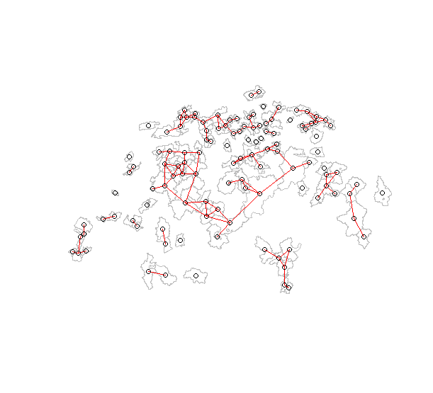

```{r setup, include=FALSE}
knitr::opts_chunk$set(echo = FALSE)
# controls
analysis_date = "2024-06-11"
controls = readRDS(paste0("../savepoints/savepoint_",analysis_date,"/controls.rds"))
setwd("..")
source("R/setup.R")
setwd("presentations")
# load data
ww1 = readRDS(fs::path("../",controls$savepoint,"ww1.rds"))
shapes = readRDS(fs::path("../",controls$savepoint,"shapes.rds"))
ww_all = readRDS(file=paste0("../",controls$savepoint,"ww_all.rds"))
ma5.4.5 = readRDS(fs::path("../",controls$savepoint,"ma5.4.5.rds"))
corr_all_ara = readRDS(file=paste0("../",controls$savepoint,"corr_all_ara.rds"))


# Relabelling -------------------------------------------------------------

# WWTP number from 1 to 118 sorted by canton
wwtpnumber = ww_all %>% 
  dplyr::filter(below_lod==0,below_loq==0) %>% 
  dplyr::group_by(kt,ara_kt,week) %>% 
  dplyr::summarise(mvl=median(vl,na.rm=TRUE),.groups="drop") %>% 
  dplyr::mutate(wwtp_index=as.numeric(as.factor(ara_kt))) %>% 
  dplyr::select(ara_kt,wwtp_index) %>% 
  dplyr::distinct() 

# lab numbers as letters with EAWAG first
labo_names = tibble(lab_method=c("EAWAG_0","ALTGR_0","Eurofins_0","Eurofins_1","KLZH_0","LdU_0","Microsynth_0","Microsynth_1","SCAV_NE_0","SUPSI_0"),
                 labo_label=c("A (ref.)","B","C1","C2","D","E","F","G1","G2","H"))
labo_cov = tibble(Variable=c("lab_methodALTGR_0","lab_methodEurofins_0","lab_methodEurofins_1","lab_methodKLZH_0",      
                            "lab_methodLdU_0","lab_methodMicrosynth_0" ,"lab_methodMicrosynth_1", "lab_methodSCAV_NE_0",   
                            "lab_methodSUPSI_0","weekend","hol","prop_under_20b",        
                            "prop_over_65b","ssep3_medb","employment_factorb"),
                  labo_label=c("B","C1","C2","D","E","F","G1","G2","H",
                       "Week-end","Public holiday","Proportion aged <20","Proportion aged >65","Median Swiss-SEP","Employment factor"))
ww_all = ww_all %>% 
  left_join(wwtpnumber,by="ara_kt") %>% 
  left_join(labo_names,by="lab_method")

```


## Data

```{r data_mis1, fig.height=4,fig.width=5.5}
ww1 %>% 
  ggplot() +
    geom_point(aes(x=date,y=ara_kt,colour=kt),size=.3) +
    scale_y_discrete(limits=rev) +
    scale_colour_discrete(guide="none") +
    theme(axis.text.y = element_text(size=3)) +
    labs(x="Date",y="WWTP")
```


<!-- ## Data -->

<!-- ```{r data_mis2, fig.height=3.5,fig.width=4.5, fig.cap="Number of viral load measurements by ARA."} -->
<!-- mw_110_map_missing(ww_all,shapes) -->
<!-- ``` -->


## Data

Large \alert{heterogeneity} across time and space:

```{r data_vl1, fig.height=2.3,fig.width=4,fig.cap="Daily SARS-CoV-2 viral load in wastewater by ARA (removing values below the LOD or LOQ)."}
mw_106_fig_vl_time(ww_all)
```

## Data

```{r}
mw_104_fig_vl(ww_all)
```


## Data

Difficulties of \alert{interpretation}:

```{=tex}
\begin{figure}
\centering
\includegraphics[width=.9\linewidth]{figures/lausanne}
\caption{Viral load in wastewater as of 31 October 2023, Lausanne VD (Vidy) \textit{(FOPH dashboard, covid19.admin.ch)}.}
\end{figure}
```

## Objectives

1.  Disentangle the \alert{various sources of heterogeneity} (Julien)

-   laboratory, quantification method, systematic temporal or spatial effects, local characteristics... \pause\bigskip

2.  Extract a clean, \`\`noise-free'' \alert{temporal signal} (Julien)

-   at the regional level  \pause\bigskip

3.  Identify \alert{clusters} among WWTPs (James)

-   WWTPs with similar dynamics

## Methods

\alert{Space-time} model based on gamma regression, accounting for:

-   limits of detection (LOD) and of quantification (LOQ) \pause

-   systematic temporal effects (public holidays, weekends) \pause

-   effect of \alert{laboratory} and quantification method

-   other local characteristics\pause

-   regional \alert{time trends} (RW2)

-   \alert{systematic shift} for each ARA (IID)

-   deviations from national trend for each ARA (BYM) 

## Methods

Other \alert{local characteristics} of WWTPs:

-   proportion of population aged >65 (from STATPOP)

-   proportion of population aged <20 (from STATPOP)

-   median index of socio-economic position (Panczak et al. 2023)

-   employment factor (full-time equivalent jobs per population from STATENT)

## Methods

Besag-York-Mollié model:

-   tendency for \alert{adjacent areas} to share similar characteristics

-   Intrinsic Conditional Auto-Regressive (ICAR) models for \alert{spatial auto-correlation between neighboring areas}

-   The BYM model (1991) includes both an ICAR component and an ordinary random effect (Independent and identically distributed, **iid**)

-   Parameter $\phi$ measures the proportion of spatial variability that follows the \alert{neighbor structure}

## Methods



## Results

Posterior predictive check (\alert{model fit}) is quite good.

```{r res_fit1, fig.height=7,fig.width=12,fig.cap="Model fit."}
ppp_vl_ara(ww_all,ma5.4.5) + facet_wrap(~ara_name,ncol=10) + labs(title=NULL)
```

## Results

Posterior predictive check (\alert{model fit}) is generally quite good.

```{r res_fit2, fig.height=2.3,fig.width=4,fig.cap="Model fit."}
ppp_vl_ara(ww_all,ma5.4.5,selection=1:6) + facet_wrap(~ara_name,ncol=3) + labs(title=NULL)
```

## Results

Posterior predictive check (\alert{model fit}) is generally quite good.

```{r res_fit3, fig.height=2.3,fig.width=4,fig.cap="Model fit."}
ppp_vl_ara(ww_all,ma5.4.5,selection=7:12) + facet_wrap(~ara_name,ncol=3) + labs(title=NULL)
```

## Results

Effect of \alert{laboratory} and method (reference is EAWAG_0):

-   $\exp(\beta)$ can be interpreted as a \alert{relative viral load}, e.g., the viral load is *on average* 33 times lower in lab C1 than lab A

```{r res1,  out.width="70%", fig.height=2.1,fig.width=4,fig.cap="Estimated effect of laboratory (laboratory name) and method change (marked by 0 and 1)."}
plot_exp_vl(ma5.4.5,pars="lab", ref="A (ref.)",labs=labo_cov,col="firebrick")+ coord_cartesian(ylim=c(0,2))
# plot_exp_vl(ma5.4.5,pars="lab|method", ref="EAWAG_0", clean.out = "lab_method")

```

## Results

Effect of \alert{public holidays} and \alert{weekends}:

-   no clear influence

```{r res2,  out.width="50%", fig.height=2.1,fig.width=3,fig.cap="Estimated effect of holidays and weekends."}
plot_exp_vl(ma5.4.5,pars="hol|weekend",labs=labo_cov,col="dodgerblue") + coord_cartesian(ylim=c(.7,1.3))
```


## Results

Effect of local characteristics:

-   association with population \alert{age structure}

```{r res3,  out.width="50%", fig.height=2.4,fig.width=4,fig.cap="Estimated effect of holidays and weekends."}
plot_exp_vl(ma5.4.5,pars="pop_total|prop_under_20|prop_over_65|prop_non_ch_eu|ssep3_|emp",labs=labo_cov,col="seagreen")   + coord_cartesian(ylim=c(.7,1.3))
```

## Results

Specificities of \alert{specific WWTPs}:

-   some WWTPs have consistently higher or lower viral loads

-   structured geographically ($\phi$=0.46)

```{r res4,  out.width="70%", fig.height=3.5,fig.width=4,fig.cap="Estimated ARA-specific effects."}
mw_130_map_relative_vl(ma5.4.5,corr_all_ara,shapes)
```


## Results

Average temporal trend at the \alert{regional} level:

-   accounts for all aspects described before

```{r res5,  out.width="80%", fig.height=3,fig.width=5,fig.cap="Estimated average temporal trend at the national level."}
region_labs = tibble(nam=c("Northwest","Northwest","Central","Zurich","Eastern","Mittelland"),
                     x=c("2022-05-25","2022-05-25","2022-07-10","2023-04-01","2023-09-20","2023-09-10"),
                     y=c(9,9,.14,5.5,8,5),
                     xend=c("2022-03-14","2022-07-17","2022-05-24","2023-03-22","2023-11-03","2023-11-03"),
                     yend=c(12,9,.12,3.6,6.5,4.7))

avg_time_trend_reg(ww_all,ma5.4.5) +
  geom_segment(data=region_labs,aes(x=as.Date(x),y=y,xend=as.Date(xend),yend=yend),linewidth=.2) +
  geom_label(data=region_labs,aes(x=as.Date(x),y=y,label=nam,colour=nam),size=3,show.legend=FALSE) +
  theme(legend.position="none")

```

## Results

\alert{Correlation} with hospitalizations:

-   come on top of all aspects described before

```{r res6,  out.width="80%", fig.height=3,fig.width=5,fig.cap="Correlation between regional trends and hospitalizations."}
 mw_140_regional_correlation(ww_all,ma5.4.5,corr_all_ara,type="hospitalizations") 
```

## Results

\alert{Correlation} with hospitalizations:

-   higher than with raw viral load

```{r res7,  out.width="80%", fig.height=3,fig.width=5,fig.cap="Correlation between regional trends and hospitalizations."}
mw_141_crude_correlation(ww_all,corr_all_ara,type="hospitalizations")
```

## Discussion

1.  Disentangle the \alert{various sources of heterogeneity}

-   important variations across \alert{laboratories}

-   association with population \alert{age structure}

-   small remaining spatial variability (commuting, tourism...) \pause\bigskip

2.  Extract a clean, \`\`noise-free'' \alert{temporal signal}

-   regional time trends

-   high correlation with COVID-19 hospitalizations


## Paper

- First draft circulated to James

- Journal?

- Co-authors? (EAWAG, FOPH, ETHZ...)
